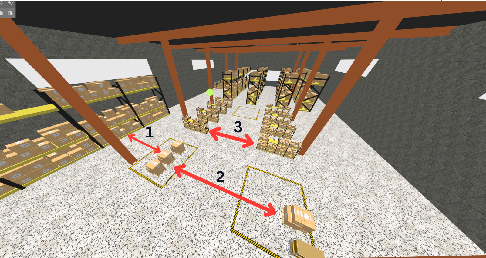
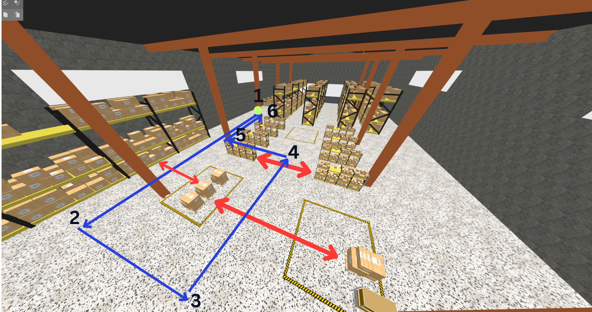

# Proyecto Final: Navegación Autónoma y Misión de Patrullaje con ROS 2

Este proyecto final está diseñado para validar tus habilidades en la configuración de un stack de navegación completo para un robot móvil autónomo (AMR). Utilizarás ROS 2 y Nav2 dentro del simulador Gazebo.

El objetivo es guiar al robot desde la generación de mapas (SLAM) hasta la ejecución de una lógica de misión de alto nivel (autonomía), pasando por la configuración fina de controladores y la evasión de obstáculos.

<div align="center">

</div>

---

## Parte 1: Percepción y Simulación del Entorno

En esta fase, prepararás el entorno virtual y lo digitalizarás para que el robot pueda ubicarse.

### Tarea 1.1: Mapeo de Entornos (SLAM)

Tu primer objetivo es generar mapas de ocupación 2D de alta calidad utilizando los mundos proporcionados en el paquete `bcr_bot/worlds`:

1.  `tugbot_depot.sdf`
<div align="center">

</div>

2.  `tugbot_warehouse.sdf`
<div align="center">

</div>

Para analizar cómo la velocidad del robot afecta la calidad del mapa, realizarás el mapeo en dos condiciones diferentes para cada mundo:
-   **Velocidad Estándar:** Velocidad lineal de `0.5 m/s` y velocidad angular de `0.7 rad/s`.
-   **Velocidad Alta:** Velocidad lineal de `1.5 m/s` y velocidad angular de `1.5 rad/s`.

### Tarea 1.2: Añadir Obstáculos Dinámicos

A partir de ahora, trabajarás exclusivamente con el mundo `tugbot_warehouse.sdf`. Para simular un entorno más realista y desafiante, añadirás "actores" (peatones) que se mueven a lo largo de trayectorias predefinidas.

Añade 3 actores al archivo `.sdf`. Puedes usar el siguiente fragmento de código como plantilla. La velocidad de los actores debe ser de **1.0 m/s**.

```xml
<actor name="actor_walking">
    <skin>
        <filename>https://fuel.gazebosim.org/1.0/Mingfei/models/actor/tip/files/meshes/walk.dae</filename>
        <scale>1.0</scale>
    </skin>
    <animation name="walk">
        <filename>https://fuel.gazebosim.org/1.0/Mingfei/models/actor/tip/files/meshes/walk.dae</filename>
        <interpolate_x>true</interpolate_x>
    </animation>
    <script>
        <loop>true</loop>
        <delay_start>0.000000</delay_start>
        <auto_start>true</auto_start>
        <trajectory id="0" type="walk">
            <waypoint>
                <time>0.0</time>
                <pose>0 2.0 1.0 0 0 1.57</pose>
            </waypoint>
            <waypoint>
                <time>3.0</time>
                <pose>0 5.0 1.0 0 0 1.57</pose>
            </waypoint>
            <waypoint>
                <time>6.0</time>
                <pose>0 2.0 1.0 0 0 -1.57</pose>
            </waypoint>
            <waypoint>
                <time>9.0</time>
                <pose>0 2.0 1.0 0 0 -1.57</pose>
            </waypoint>
        </trajectory>
    </script>
</actor>
```
Observa la imagen a continuación; las flechas rojas bidireccionales indican las posiciones iniciales y finales aproximadas de los actores. Deberás determinar manualmente las coordenadas de estos puntos para configurar los waypoints en el archivo .sdf.

Nota: Puedes obtener estas coordenadas manualmente abriendo Gazebo y observando la grilla, o moviendo temporalmente un objeto a las zonas indicadas para leer sus valores $(x, y)$. No se requiere precisión exacta ni algoritmos de estimación; basta con que la trayectoria se asemeje visualmente a la imagen de referencia.

<div align="center">

</div>
---

## Parte 2: Navegación Autónoma con Nav2

El núcleo del proyecto es la implementación de Nav2. Para ello, deberás crear un paquete dedicado a la configuración de la navegación.

### Tarea 2.1: Creación del Paquete de Navegación

Crea un nuevo paquete llamado `bcr_bot_nav2` que contendrá todos los archivos de configuración, mapas y lanzadores necesarios para ejecutar Nav2. Este paquete centralizará toda la lógica de navegación y su estructura final debe ser la siguiente:
```bash
bcr_bot_nav2/
├── config/
│   ├── mapper_params.yaml    # Parámetros para SLAM
│   ├── nav2_params.yaml      # Parámetros para navegación
├── launch/
│   ├── mapping_launch.py     # Lanzamiento para mapeo
│   ├── navigation_launch.py  # Lanzamiento para navegación
├── rviz/
│   ├── nav2_config.rviz      # Configuración de RViz para navegación (Opcional)
├── maps/                     # Mapas generados en la Parte 1
│   ├── tugbot_warehouse.pgm
│   ├── tugbot_warehouse.yaml
├── package.xml
└── CMakeLists.txt
```

Prueba de concepto: El robot debe ser capaz de navegar desde un punto de inicio hasta un Goal Pose definido en RViz, evitando los actores dinámicos creados en la Parte 1.

### Tarea 2.2: Controladores y Análisis de Behavior Trees

En esta tarea, trabajarás sobre la configuración del paquete `bcr_bot_nav2` y realizarás un análisis teórico:

1. Prueba de Controladores: Modifica el archivo `nav2_params.yaml` para configurar y probar los siguientes Controller Servers. Debes verificar el desempeño de cada uno en la simulación:
   - DWB (Dynamic Window Approach): El controlador por defecto.
   - MPPI (Model Predictive Path Integral): Un controlador predictivo avanzado.

2. Análisis de Behavior Tree: Se te proporciona un archivo llamado `assets/custom_bt.xml`. No es necesario implementarlo ni ejecutarlo en tu configuración de Nav2. Tu tarea es abrir el archivo, leer el código XML y explicar su lógica en el informe final (ver sección de Entregables).

## Parte 3: Logica de alto nivel

La capa superior del stack es la "Misión". Implementarás un nodo de autonomía utilizando la API de Python `nav2_simple_commander`.

### Tarea 3.1: Implementación de la Lógica de alto nivel
Una vez completada la implementación de Nav2 con el robot `bcr_bot`, el objetivo es que el robot realice un patrullaje cíclico entre 6 puntos de interés (waypoints) en el ambiente `tugbot_warehouse.sdf`.

Crea un nuevo paquete llamado `bcr_bot_patrol` con el nodo o nodos necesarios para cubrir la siguiente ruta:

- Home / Estacion de carga -> (13.9, -10.6)
- Punto 1 -> (10.0, -10.6)
- Punto 2 -> (10.0, 19.0)
- Punto 3 -> (0.0, 19.0)
- Punto 4 -> (0.0, 6.5)
- Punto 5 -> (9.5, 6.5)
- Punto 6 -> (9.5, -10.6)

<div align="center">

</div>

Se recomienda utilizar `nav2_simple_commander` para enviar los objetivos (goal poses) al robot. Puedes consultar la documentación oficial para inspirarte en la implementación: https://docs.nav2.org/commander_api/index.html


## Entregables
Para la entrega, deberás subir un archivo comprimido con tu workspace (asegurando que contenga los paquetes `bcr_bot`, `bcr_bot_nav2` y `bcr_bot_patrol`) y un archivo de texto llamado `respuestas_proyecto.txt` con el siguiente contenido:

### Parte 1: Sobre Mapeo y Simulación.

1. ¿Cómo afectó cualitativamente el aumento de velocidad (1.5 m/s) a la calidad del mapa? (Mencione distorsión de paredes, loop closure, etc.).

2. ¿Influyó el tamaño del ambiente (Depósito vs. Almacén) en la dificultad para generar el mapa? ¿Por qué?

### Parte 2: Sobre Navegación Autónoma.

3. Análisis de Behavior Tree: Abra el archivo `assets/custom_bt.xml` y explique detalladamente su funcionamiento. ¿Qué lógica sigue y qué nodos de control de flujo utiliza? (Nota: Solo explicación teórica, no requiere implementación).

4. Comparativa de Controladores: ¿Cuál ofreció mejor rendimiento (suavidad, evasión de obstáculos) entre DWB y MPPI? Justifique su respuesta basándose en sus pruebas.

5. ¿Cómo alteran los obstáculos dinámicos la planificación de la trayectoria global y local?

### Parte 3: Sobre Autonomía: 
6. Explique la lógica del código implementado en su script de patrullaje.

7. Proponga 2 mejoras para optimizar la eficiencia del patrullaje (ej. gestión de batería, reordenamiento de puntos).
